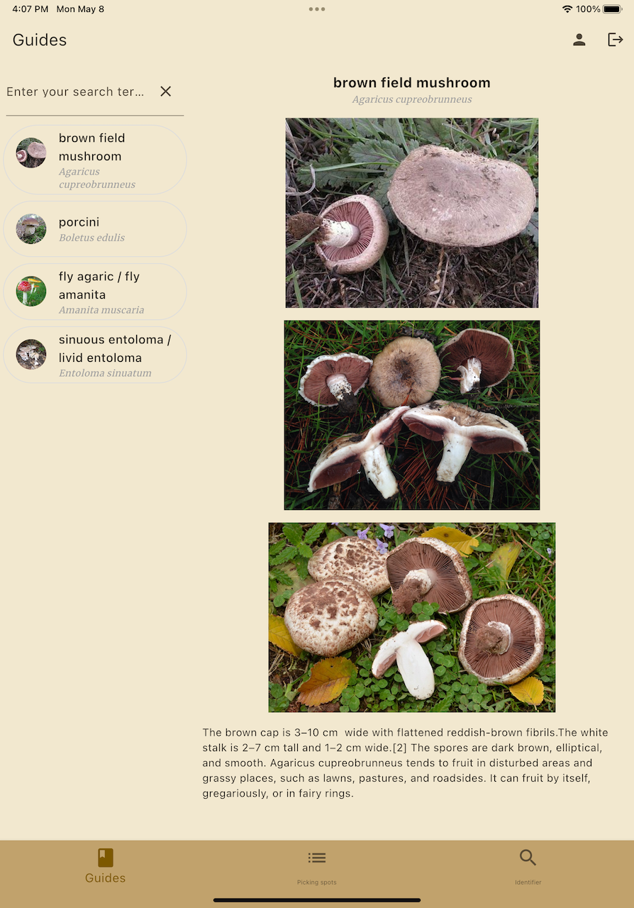

# Foraging Buddy Demo

An mobile application for mushroom picking guides and identification with simple demo data, release version will have complete data.

## App main features:
- guides for mushrooms picking
- picking spots saving and viewing and deleting
- mushroom identification (currently by genus), later version by species, results saving, viewing and deleting

## Features descriptions:
- app runs on Android and iOS
- account login by google and facebook
- all screens are responsively designed, different layout for mobile and tablet
- mushrooms guides stored locally on SQLite database
- picking spots and results are stored on Firebase Cloud database
- mushroom identifier used tflite, model is trained using tensorflow.js using dataset containing 6700 mushrooms images by 9 genus (Agaricus, Amanita, Boletus, Cortinarius, Entoloma, Hygrocybe, Lactarius, Russula, Suillus) 

## Install file
Apk file install : https://1drv.ms/u/s!AhUnCCd__w0BjstVAn24Fdd91Cu37w?e=aRXyXc

## Screens:

